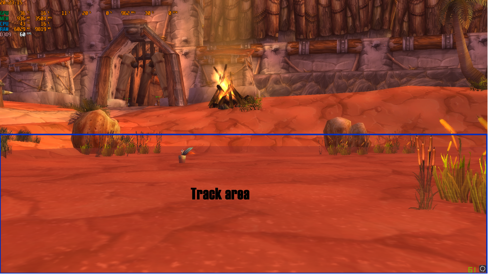
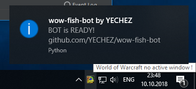

# wow-fish-bot | DEV-BRANCH !
## WoW Vanilla fish bot. Python, simple, for me. World of Warcraft 1.12.1
### ADDED tray-icon with information

- No hook sounds, work with all resolution.
- Using packages: Pillow, PyAutoGUI, PyQt5, numpy, opencv-python, pywin32 (Project Interpreter - PyCharm)
- code = 92 lines with spaces.

> This is tested application before Windows app release

How to:
1. Equip fishing pole
2. Move skill 'Fishing' to slot with bind '1'
3. Hide World of Warcraft UI (ALT + Z)
4. Full camera zoom
5. Run bot

- Work only if found active window 'World of Warcraft'
- How it work: 
> With cv2 the bot tracks the splashes on water and clicks into the point via LeftShift + RMB
* Bot has false positives because simple
- Best performance on 800x600 Windowed Mode, no maximized
or 1920x1080 maximized

- Tested on areas: Orgrimmar, near WC dungeon and Ratchet
- Works pretty normal (80%)
- Gif - https://imgur.com/a/IRftPyX

